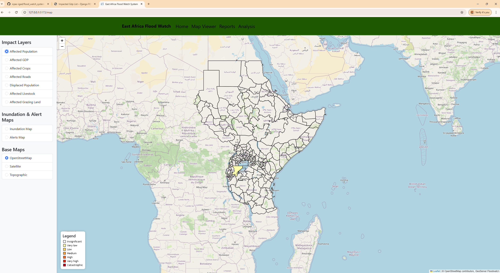

# Flood Watch System

## Table of Contents
- [Introduction](#introduction)
- [Getting Started](#getting-started)
- [Build and Test](#build-and-test)
- [Data Synchronization](#data-synchronization)

## Introduction
A comprehensive system for flood monitoring and reporting, featuring a Django-based backend and a React-based frontend.



---

## Getting Started

1. Ensure you have a `.env` file in the root directory with the following environment variables:
   ```plaintext
   DB_HOST=db
   DB_PORT=5432
   DB_USER=your_db_user
   DB_PASSWORD=your_db_password
   DB_NAME=your_db_name
   SECRET_KEY=your_secret_key
   DEBUG=1
   DJANGO_ALLOWED_HOSTS=localhost,127.0.0.1
   CORS_ALLOWED_ORIGINS=True
   CORS_ORIGIN_WHITELIST=http://localhost:5173
   API_VERSION=v1
   REDIS_HOST=redis
   REDIS_PORT=6379
   REMOTE_FOLDER_BASE=your_remote_folder_base
   SFTP_HOST=your_sftp_host
   SFTP_PORT=your_sftp_port
   SFTP_USERNAME=your_sftp_username
   SFTP_PASSWORD=your_sftp_password
   ```

2. Navigate to the `backend` directory and set up a virtual environment:
   - **Windows:**
     ```bash
     python -m venv env
     env\Scripts\activate
     ```
   - **Linux/macOS:**
     ```bash
     python3 -m venv env
     source env/bin/activate
     ```

3. Install the required Python dependencies:
   ```bash
   pip install -r requirements.txt
   ```

4. Return to the main directory containing the `docker-compose.yml` file:
   ```bash
   cd ..
   ```

5. Build and start all services using Docker Compose:
   ```bash
   docker compose build --no-cache
   docker compose up
   ```

---

## Build and Test

1. Use the `docker compose` command to build and start all services:
   ```bash
   docker compose build --no-cache
   docker compose up
   ```

2. Access the application:
   - Backend API: [http://localhost:8000](http://localhost:8000)
   - Frontend: [http://localhost:5173](http://localhost:5173)

---

## Data Synchronization

To synchronize data from the floodPROOFS model output server, ensure the remote server credentials are configured in the `.env` file, then run the following command inside the `web` container:
```bash
docker exec -it <container_name> python manage.py sync_shapefiles
```

---
```